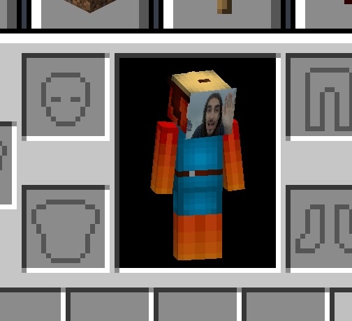

# 📹 WebcamHead - Show Your Face in Minecraft!

<div align="center">

**Transform your Minecraft skin into a live webcam feed! See your friends' faces on their in-game characters in real-time.**

[](https://www.minecraft.net/)
[](https://fabricmc.net/)
[](../../releases)

[🎮 Download](#-installation) | [📖 How It Works](#-how-it-works) | [🚀 Quick Start](#-quick-start) | [❓ Troubleshooting](#-troubleshooting)



</div>

---

## 🎯 What is WebcamHead?

WebcamHead is a Minecraft mod that lets you **stream your webcam directly onto your player's face**. When you're playing with friends, they'll see your real face on your character's head instead of the regular Minecraft skin!

### ✨ Features

- 🎥 **Live webcam streaming** - Your face appears on your Minecraft character's head
- 👥 **Multiplayer ready** - Everyone in the server can see each other's webcams
- 🌐 **Web viewer** - Watch all players from any browser
- ⚡ **Low bandwidth** - Only ~80 KB/s per player
- 🎮 **Simple controls** - Just press **V** to toggle on/off
- 📹 **Multi-camera support** - Choose between different webcams
- 🔒 **Privacy-focused** - You control when your webcam is on

### 🎬 How It Works

1. **You press V** → Your webcam turns on
2. **Face appears** → Your real face shows up on your Minecraft character's head
3. **Friends see you** → Everyone on the server sees your live webcam
4. **Press V again** → Webcam turns off, back to normal skin

No complicated setup, no technical knowledge required!

---

## 💾 Installation

### For Players (Client Installation)

#### Step 1: Download Required Files

1. **Download the WebcamHead mod** from the [Releases page](../../releases)
2. **Install Fabric Loader**:
   - Go to [FabricMC](https://fabricmc.net/use/installer/)
   - Download and run the installer
   - Select Minecraft 1.21.3 and click Install
3. **Download Fabric API**: [CurseForge](https://www.curseforge.com/minecraft/mc-mods/fabric-api) or [Modrinth](https://modrinth.com/mod/fabric-api)

#### Step 2: Install the Mod

1. Open your Minecraft folder:
   - **Windows**: Press `Win + R`, type `%appdata%\.minecraft`, press Enter
   - **macOS**: Open Finder, press `Cmd + Shift + G`, type `~/Library/Application Support/minecraft`, press Enter
   - **Linux**: Navigate to `~/.minecraft`

2. Put the files in the `mods` folder:
   - `webcamhead-X.X.X.jar` (the mod you downloaded)
   - `fabric-api-X.X.X.jar` (Fabric API you downloaded)

3. Launch Minecraft with the Fabric profile

#### Step 3: First Launch

1. Start Minecraft
2. Join a world (singleplayer or multiplayer)
3. Press **V** on your keyboard
4. Your webcam should activate! 🎉

> **Note**: On first use, your operating system will ask for camera permissions. Click "Allow" to let Minecraft access your webcam.

### 🍎 macOS Users - Important!

If you're on macOS and the camera permission popup doesn't appear, use **Prism Launcher** instead of the official Minecraft launcher:

1. Download [Prism Launcher](https://prismlauncher.org/) (it's free!)
2. Create a Fabric instance in Prism Launcher
3. Add the mod to your instance
4. Launch the game
5. Press V → Permission popup will appear → Click Allow ✅

**Why?** macOS has strict security rules. The official Minecraft launcher doesn't meet macOS's requirements for camera access, but Prism Launcher does.

---

## 🖥️ Server Setup

Want to stream webcams with friends? You'll need a streaming server!

### Option 1: Docker (Easiest!) 🐳

**Perfect if you want to deploy on a VPS or server:**

```bash
# Pull and run the server
docker run -d -p 3000:3000 tdqdev/webcamhead-server:latest
```

Done! Server is running on `http://your-server-ip:3000`

👉 **For detailed Docker deployment**: See [streaming-server/README.Docker.md](streaming-server/README.Docker.md)

### Option 2: Manual Installation

**For local testing or advanced users:**

1. **Install Node.js**:
   - Download from [nodejs.org](https://nodejs.org/) (version 18 or newer)

2. **Download and start the server**:
   ```bash
   cd streaming-server
   npm install
   npm start
   ```

3. **Server is ready!** You'll see:
   ```
   ╔══════════════════════════════════════════════════════════╗
   ║  WebcamHead Video Streaming Server                      ║
   ║  Status: RUNNING                                         ║
   ║  Port: 3000                                             ║
   ║  WebSocket: ws://localhost:3000                         ║
   ║  API: http://localhost:3000/api                         ║
   ║  Web Viewer: http://localhost:3000/viewer              ║
   ╚══════════════════════════════════════════════════════════╝
   ```

### Connect the Mod to Your Server

In Minecraft, type this command:
```
/webcam server http://YOUR_SERVER_IP:3000
```

For local testing, use:
```
/webcam server http://localhost:3000
```

---

## 🎮 Quick Start

### First Time Use

1. **Start Minecraft** with the mod installed
2. **Join a world** (singleplayer or multiplayer)
3. **Press V** to toggle your webcam
4. **Look at yourself** in third person (F5) - you should see your webcam on your face!

### Playing with Friends

1. **Set up a streaming server** (see [Server Setup](#️-server-setup))
2. **Everyone runs this command** in Minecraft:
   ```
   /webcam server http://YOUR_SERVER_IP:3000
   ```
3. **Everyone presses V** to turn on their webcams
4. **See each other's faces** on your characters! 🎉

### Web Viewer

Want to see all webcams at once? Open your browser and go to:
```
http://YOUR_SERVER_IP:3000/viewer
```

You'll see a grid with everyone's webcam feed!

---

## ⌨️ Controls & Commands

### Keyboard Shortcut

- **V** - Toggle webcam on/off

### In-Game Commands

| Command | What it does |
|---------|-------------|
| `/webcam server <url>` | Connect to a streaming server |
| `/webcam info` | Show your current settings |
| `/webcam list` | See all available cameras on your computer |
| `/webcam device <number>` | Switch to a different camera (0, 1, 2...) |
| `/webcam state` | Check connection status |
| `/webcam stats` | View streaming statistics |
| `/webcam join <roomId>` | Join a specific room (for organizing groups) |

---

## 💡 How It Works (Simple Explanation)

```
┌─────────────────┐
│  Your Webcam    │  ← Captures your face
└────────┬────────┘
         │
         ↓
┌─────────────────┐
│  Minecraft Mod  │  ← Puts it on your character
└────────┬────────┘
         │
         ↓
┌─────────────────┐
│ Streaming Server│  ← Shares it with friends
└────────┬────────┘
         │
         ↓
┌─────────────────┐
│ Friends' Games  │  ← They see your face!
└─────────────────┘
```

1. Your webcam captures video
2. The mod puts it on your Minecraft skin (128x128 pixels on your face)
3. The streaming server relays the video to other players
4. Your friends see your live webcam on your character's head!

**Privacy**: The webcam only streams when you press V. Press V again to turn it off instantly.

---

## ❓ Troubleshooting

### Webcam Not Working

**Camera not starting?**
- ✅ Check camera permissions in your OS settings
- ✅ Make sure no other app is using the camera (Zoom, Skype, etc.)
- ✅ Try `/webcam list` to see if your camera is detected
- ✅ Try a different camera with `/webcam device 1`

**On macOS and permission popup doesn't appear?**
- Use [Prism Launcher](https://prismlauncher.org/) instead of official Minecraft launcher

### Multiplayer Issues

**Friends can't see your webcam?**
- ✅ Make sure everyone is connected to the same server: `/webcam info`
- ✅ Check you're in the same room: `/webcam state`
- ✅ Verify server is running: Open `http://SERVER_IP:3000/api/health` in browser
- ✅ Check firewall allows port 3000

**Server won't start?**
- ✅ Make sure port 3000 is not already in use
- ✅ Install Node.js 18 or newer
- ✅ Run `npm install` in the streaming-server folder

### Performance Issues

**Game lagging?**
- Lower webcam quality in config (defaults to 320x240)
- Reduce FPS (defaults to 15fps)
- Check your internet connection

**High bandwidth usage?**
- Each webcam uses ~80 KB/s upload and download per player
- With 5 players: ~400 KB/s (still very reasonable!)

---

## 📚 Documentation

**For more details:**

- 📖 **[USER_GUIDE.md](USER_GUIDE.md)** - Complete user guide with advanced features
- 🐳 **[streaming-server/README.Docker.md](streaming-server/README.Docker.md)** - Docker deployment guide
- 📡 **[STREAMING_IMPLEMENTATION.md](STREAMING_IMPLEMENTATION.md)** - How streaming works (technical)

---

## 🌐 System Requirements

### Minimum Requirements

- **Minecraft**: 1.21.3
- **Mod Loader**: Fabric Loader 0.17.3+
- **Fabric API**: 0.114.1+1.21.3+
- **Java**: 21 or newer
- **Webcam**: Any USB or built-in webcam
- **RAM**: 4GB minimum (standard Minecraft requirements)

### For Server Hosts

- **Node.js**: 18 or newer
- **Port**: 3000 (or your custom port)
- **Bandwidth**: ~80 KB/s per player

---

## 🤝 Contributing

Want to help improve WebcamHead? Contributions are welcome!

- Report bugs: [Open an issue](../../issues)
- Suggest features: [Start a discussion](../../discussions)

---

## 📄 License

This project is licensed under the MIT License - see the [LICENSE](LICENSE) file for details.

---

## 🙏 Credits

Built with amazing open-source technologies:

- [Fabric](https://fabricmc.net/) - Minecraft modding framework
- [JavaCV](https://github.com/bytedeco/javacv) - Webcam capture
- [Socket.IO](https://socket.io/) - Real-time streaming
- [React](https://react.dev/) - Web viewer interface

---

<div align="center">

**Made with ❤️ by Théo VIDAL**

[⬆ Back to top](#-webcamhead---show-your-face-in-minecraft)

</div>
